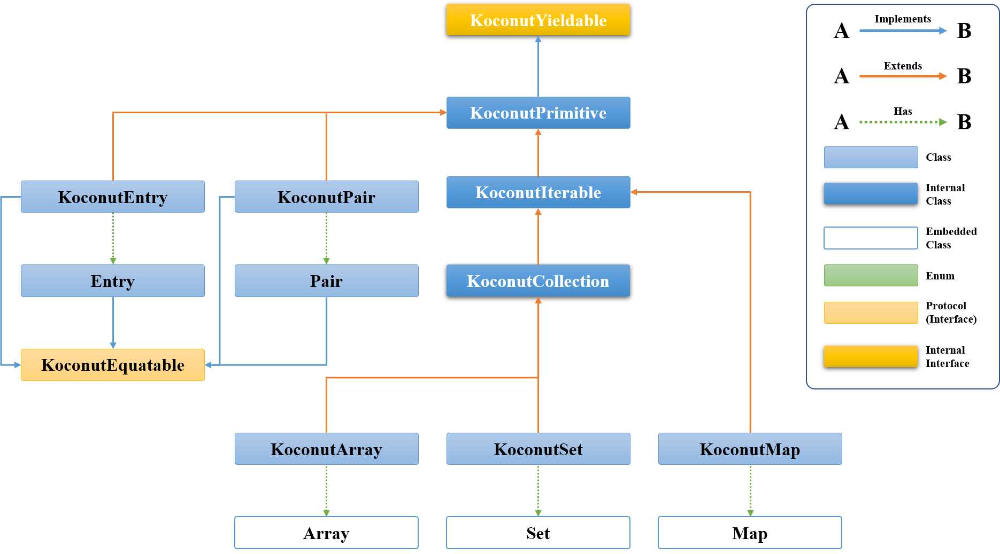

# Koconut : Kotlin Style Collection Lib For Node.Js 

<!-- I.O Sheilds -->
[![npm version][npm-image]][npm-url]
[![Travis][travis-image]][travis-url]
[![License][license-image]][license-url]


<!--
[![Node.js Version][node-version-image]][node-version-url]
http://img.shields.io/node/v/koconut.svg
-->

# Table of Contents
- [Installation](#Installation)
- [Introduction](#Introduction)
- [Components](#Components)
- [Necessity](#Necessity)
- [Examples](#Examples)
- [Deprecation Warning](#Deprecation-Warning)
- [License](#License)

# Installation

This is a [Node.js](https://nodejs.org/en/) library available through the [npm registry](https://www.npmjs.com/).

Before you install it, please [download and install Node.js](https://nodejs.org/en/download/).

Currently, [Koconut] does not require specific node version, however it is recommended to be 0.8.x or higher since this library depends on [Promise] a lot.

Installation is done by using [`npm install` command](https://docs.npmjs.com/getting-started/installing-npm-packages-locally)

```sh
$ npm install koconut --save
```

# Introduction

This is a node.js library for collection(a.k.a data structure). It's fully written in TypeScript, but also compatible with JavaScript application. It is 100% [Apache-2.0](https://github.com/ApexCaptain/Koconut/blob/master/LICENSE) licensed.

Here is a short example on how to use it:

### TypeScript
```ts
import {
    KoconutArray
} from "koconut"

const sampleProcess = async () => {
    const myArray = KoconutArray.of(1,2,3,4,5,6)

    const evenNumbers = await myArray
                        .filter(eachNumber => eachNumber % 2 == 0)
                        .yield()

    console.log(evenNumbers)
    // ↑ [ 2, 4, 6 ]
}
sampleProcess()
```

### JavaScript (CommonJs)
``` js
const {
    KoconutArray
} = require("koconut")

const sampleProcess = async () => {
    const myArray = KoconutArray.of(1,2,3,4,5,6)
    
    const evenNumbers = await myArray
                        .filter(eachNumber => eachNumber % 2 == 0)
                        .yield()

    console.log(evenNumbers)
    // ↑ [ 2, 4, 6 ]
}
sampleProcess()
```

As you can see, there's no big difference between using it in JS and TS. Both examples created an 1 to 6 integer array and filtered only the even numbers.

# Components
## Documents
The full document of this library is running on [git-hub page].

### Container
- [KoconutEntry]
- [Entry]
- [KoconutPair]
- [Pair]
- [KoconutArray]
- [KoconutSet]
- [KoconutMap]
### Enum
- [KoconutLocale]
- [KoconutLoopSignal]
### Exception
- [KoconutConflictException]
- [KoconutIndexOutOfBoundsException]
- [KoconutInvalidArgumentException]
- [KoconutNoSuchElementException]
### Protocol (Interface)
- [KoconutComparable]
- [KoconutEquatable]
### Tool
- [KoconutOption]

## Hierarchy
This is the [Koconut] class hierarchy in current version.



# Necessity
`OK, so... why do I need it?`

[Koconut] is promise-friendly. The basic design philsophy of this library is to use `async/await` functionality without any interruption even if whlie using iterative process. Let me give you an example.

Imagine if there are 3 different http requests info. Each and every one of them has a very different purpose and cannot be merged into a single requset. You may want to handle one by one sequentially.
```ts
const requestInfoList = [
    {
        method : "POST",
        uri : "https://myServer",
        data : {
            some : 'payload1'
        }
    },
    {
        method : "GET",
        uri : "https://myServer",
        data : {
            some : 'payload2'
        }
    },
    {
        method : "DELETE",
        uri : "https://myServer",
        data : {
            some : 'payload3'
        }
    }
]
```
Now, let's send those requests with one of the most common http node.js lib, [axios](https://www.npmjs.com/package/axios).
```ts
const mainProcess = async () => {

    const results = new Array()
    requestInfoList.forEach(async eachRequestInfo => {
        const eachResult = await axios(eachRequestInfo)
        results.push(eachResult)
    })

    console.log(results) // --- [1] : Empty List
    console.log("Nailed it!") 

}
mainProcess()
```
Within upper example, each http request is handled asynchronously. However, the result of outer `forEach` function of normal `Array` is not a [Promise] instance, in other words, it does not support [Promise] nor `async/await`. 

Therefore, printed message at [1] is gonna be an empty list. This is definitely not what you've intended.

Now, you have to come up with a different way. Maybe, after some Googling and Googling (Like as I did), you'll find an answer just like below.

```ts
const mainProcess = async () => {

    const results = new Array()
    for(const eachRequestInfo of requestInfoList) {
        const eachResult = await axios(eachRequestInfo)
        results.push(eachResult)
    }

    console.log(results) // --- [1] : [ result1, result2, result3 ]
    console.log("Nailed it!") 

}
mainProcess()
```
By doing this, all the requests are sent one by one. Printed message at [1] would be an array of three request results.

The problem is resolved! Having a nice cuppa tea, reclining your seat, wow, you may leave work early today!

Or... is it?

The next day, your boss told you that each request result should be checked whether it's valid or not.

The information you need is all in some other database. So, you made another async function called `checkIsValid`.

Easy! It can be done like this.
```ts
const mainProcess = async () => {

    const results = new Array()
    for(const eachRequestInfo of requestInfoList) {
        const eachResult = await axios(eachRequesInfo)
        results.push(eachResult)
    }

    const validResults = new Array()
    for(const eachResult of results) {
        if(await checkIsValid(eachResult))
            validResults.push(eachResult)
    }

    console.log(validResults) // --- [1] : Valid results matches the given condition
    console.log("Nailed it!") 

}
mainProcess()
```
Now you have two different arrays. This is the problem. Since previous iterable classes don't support [Promise], you have to keep adding `for...of` or `for...in` statement over and over again into your source code. As time goes by and your software becomes more and more complicated, your data processing would be unrecognizable and messy.

It would be great just if you can use `filter` function instead, right?

Well, here's an example using [KoconutArray].

```ts
import { KoconutArray } from 'koconut'
const mainProcess = async () => {

    const validResults = await KoconutArray
                                .from(requestInfoList)
                                .map(axios)
                                .filter(checkIsValid)
                                .yield()

    console.log(validresults)
    console.log("Nailed it!") 

}
mainProcess()
```
Boom! It is done! No more complicated `for...of` or `for...in` iterative processes. It is safe and quite beautiful.
Of course, I know that it's pretty unnatural example. You could fetch result and validate it simultaneously just in one loop.
But by drawing upon [Koconut] library, your source code would be much more clear and efficient.

# Examples
Let me give you a few examples for basic usage of this library.
I've written only about [KoconutArray] as a representative class.
## Creation
To create a [KoconutArray] instance, you can do it in 3 different ways.
1. Using `new` keyword.

    Very traditional way. You can create a new instance from an iterable object or if it's ommitted you may have an empty array. In case of that, you'd better declare generic type explicitly.
    ```typescript
        import { KoconutArray } from 'koconut'

        const emptyKoconutNumbers = new KoconutArray<number>()
        // ↑ This is an empty Koconut number array

        const numbers = Array.of(1,2,3,4,5)
        const koconuntNumbers = new KoconutArray(numbers)
        // ↑ This is a Koconut number array consists of 1 to 5.
    ```
2. Using `static` [from](https://apexcaptain.github.io/Koconut/classes/_container_collection_array_koconutarray_.koconutarray.html#from) method.

    You can create a new instance from an iterable object.
    ```typescript
        import { KoconutArray } from 'koconut'

        const numbers = Array.of(1,2,3,4,5)
        const koconutNumbers = KoconutArray.from(numbers)
        // ↑ This is a Koconut number array consists of 1 to 5.
    ```
3. Using `static` [of](https://apexcaptain.github.io/Koconut/classes/_container_collection_array_koconutarray_.koconutarray.html#of) method.

    You can create a new instance with a variable number of arguments
    ```typescript
        import { KoconutArray } from 'koconut'

        const koconutNumbers = KoconutArray.of(1,2,3,4,5)
        // ↑ This is a Koconut number array consists of 1 to 5.
    ```
    
## Processing
All the [Koconut] containers internally connected with each other within [Promise] chain. In a nutshell, you have to process all the chained objects before you get the result. There are 3 ways to do that. They're almost same but slightly different.

1. Using [yield](https://apexcaptain.github.io/Koconut/classes/_container_collection_array_koconutarray_.koconutarray.html#yield) method.

    This method processes all the chained objects and returns the result.
    ```typescript
        import { KoconutArray } from 'koconut'

        const mainProcess = async () => {
            const koconutNumbers = KoconutArray.of(1,2,3,4,5)

            const firstNumber = await koconutNumbers
                                                .first()
                                                .yield()
            console.log(firstNumber)
            // ↑ 1
        }
        mainProcess()
    ```
2. Using [process](https://apexcaptain.github.io/Koconut/classes/_container_collection_array_koconutarray_.koconutarray.html#process) method.

    This method just simply processes all the chained objects, then return `Promise<void>`.
    ```typescript
        import { KoconutArray } from 'koconut'

        const mainProcess = async () => {
            const koconutNumbers = KoconutArray.of(1,2,3,4,5)

            await koconutNumbers
                        .forEach(console.log)
                        .process()
            // ↑ 1 2 3 4 5
        }
        mainProcess()
    ```
3. Using [let](https://apexcaptain.github.io/Koconut/classes/_container_collection_array_koconutarray_.koconutarray.html#let) method.

    This method processes all the chained objects and calls the specified function `block` with the reuslt value as its argument and returns the final result of the `block`.

    ```typescript
        import { KoconutArray } from 'koconut'

        const mainProcess = async () => {
            const koconutNumbers = KoconutArray.of(1,2,3,4,5)

            const firstNumberPlus2 = await koconutNumbers
                                    .first()
                                    .let(result => result + 2)
            console.log(firstNumber)
            // ↑ 3
        }
        mainProcess()
    ```
4. Using [also](https://apexcaptain.github.io/Koconut/classes/_container_collection_array_koconutarray_.koconutarray.html#also) method.

    This method processes all the chained objects and calls the specified function `block` with the result value as its argument and return passed result object.
    ```typescript
        import { KoconutArray } from 'koconut'

        const mainProcess = async () => {
            const koconutNumbers = KoconutArray.of(1,2,3,4,5)

            const moreNumbers = await koconutNumbers
                                    .also(result => {
                                        result.push(6)
                                        result.push(7)
                                        result.push(8)
                                    })
            console.log(moreNumbers)
            // ↑ [1, 2, 3, 4, 5, 6, 7, 8]
        }
        mainProcess()
    ```

## Iteration
Iterative methods of [KoconutArray] are [forEach](https://apexcaptain.github.io/Koconut/classes/_container_collection_array_koconutarray_.koconutarray.html#foreach), [forEachIndexed](https://apexcaptain.github.io/Koconut/classes/_container_collection_array_koconutarray_.koconutarray.html#foreachindexed), [onEach](https://apexcaptain.github.io/Koconut/classes/_container_collection_array_koconutarray_.koconutarray.html#oneach) and [onEachIndexed](https://apexcaptain.github.io/Koconut/classes/_container_collection_array_koconutarray_.koconutarray.html#oneachindexed). These methods loop to repeat given `action`. 

Methods of which names start with `for` return nothing. 

Methods start with `on` return the original collection itself.
``` typescript
    import { KoconutArray } from 'koconut'

    const mainProcess = async () => {
        const koconutNumbers = KoconutArray.of(1,2,3,4,5)

        const resultOfForEach = await koconutNumbers
                                        .forEach(console.log)
                                        // ↑ 1 2 3 4 5
                                        .yield()
        console.log(resultOfForEach)
        // ↑ undefined

        const resultOfOnEach = await koconutNumbers
                                        .onEach(console.log)
                                        // ↑ 1 2 3 4 5
                                        .yield()
        console.log(resultOfForEach)
        // ↑ [1, 2, 3, 4, 5]
    }
    mainProcess()
```
And of course, methods of which name end with `indexed` have action block given with two arguments.

 One is index, and the other is element.
## Calculation
Each calculator method has its own purpose, performing calculation according to the established rules. For instance, [maxBy] method returns the first element yielding the largest value of the given function block.
```typescript
    import { KoconutArray } from 'koconut'

    const mainProcess = async () => {
        const koconutArray = KoconutArray.of(1,2,3,4,5)

        const largestNumberOfArray = await koconutArray
                                    .maxBy(eachNumber => eachNumber)
                                    .yield()
        console.log(largestNumberOfArray)
        // ↑ 5

        try {
        await koconutArray
                .filter(eachNumber => eachNumber > 10)
                .maxBy(eachNumber => eachNumber)
                .yield()
        } catch(error) {
        console.log(error.name)
        // ↑ Koconut No Such Element Exception
        // i.e. -- Array is filtered.
        // No element in 1 to 5 is greater than 10.
        }
    }
    mainProcess()
``` 
## Manipulation
Manipulator methods rearrange the collection, add new elements or filter it by given condition. For instance, [sortedBy](https://apexcaptain.github.io/Koconut/classes/_container_collection_array_koconutarray_.koconutarray.html#sortedby) method returns a collection of all elements sorted according to natural sort order(ASC) of the value returned by specified `selector` function block.
```typescript
    import { KoconutArray } from 'koconut'

    const mainProcess = async () => {
        const koconutArray = KoconutArray.of("abcd", "ab", "abc", "a")

        const sortedStringArrayByLength = await koconutArray
                                            .sortedBy(eachString => eachString.length)
                                            .yield()
        console.log(sortedStringArrayByLength)
        // ↑ [ 'a', 'ab', 'abc', 'abcd' ]
    }
    mainProcess()
```
## Inspection
Inspector methods check the elements at given condtion. For instance, [all](https://apexcaptain.github.io/Koconut/classes/_container_collection_array_koconutarray_.koconutarray.html#all) method return `true` if all elements match the given `predicate` function block. If any one of those elements doesn't meet the condtion, it'll return `false`.
```typescript
    import { KoconutArray } from 'koconut'

    const mainProcess = async () => {
        const koconutArray = KoconutArray.of(1,2,3,4,5)

        const areAllArrayElementsGreaterThan0 = await koconutArray
                                                .all(eachNumber => eachNumber > 0)
                                                .yield()
        console.log(areAllArrayElementsGreaterThan0)
        // ↑ true

        const areAllArrayElementsEven = await koconutArray
                                        .all(eachNumber => eachNumber % 2 == 0)
                                        .yield()
        console.log(areAllArrayElementsEven)
        // ↑ false -- i.e. '1' is not an even number.
    }
    mainProcess()
``` 
## Transformation
Transformer methods convert the collection into other format. The [map](https://apexcaptain.github.io/Koconut/classes/_container_collection_array_koconutarray_.koconutarray.html#map) method is representative. It returns a list containing the results of applying the given `transform` function block to each element in this original collection.
```typescript
    import { KoconutArray } from 'koconut'

    const mainProcess = async () => {
        const koconutArray = KoconutArray.of(1,2,3,4,5)

        const dobuledNumbers = await koconutArray
                                    .map(eachNumber => eachNumber * 2)
                                    .yield()
        console.log(dobuledNumbers)
        // ↑ [ 2, 4, 6, 8, 10 ]

        const numberStrings = await koconutArray
                                    .map(eachNumber => eachNumber.toString())
                                    .yield()
        console.log(numberStrings)
        // ↑ [ '1', '2', '3', '4', '5' ]

    }
    mainProcess()
```

# Deprecation Warning
## Introduction
Some methods might no longer be supported in the future. If you have used any one of them, your application is gonna be crashed after updating the library with no reason. To prevent such troubles, [Koconut] supports `Deprecation Warning` functionality since version [1.0.10](./RELEASE.md#Release-1.0.10). 

What does that mean?

## Example
For instance, [maxBy] method in [KoconutArray] returns the first element yielding the largest value of the given function or throw [KoconutNoSuchElementException] if there are no elements. Following examples are same as written in document page.
```typescript
import { KoconutArray } from "koconut"

const main = async () => {

    // Create an 1 to 5 number array.
    const koconutArray = KoconutArray.of(1,2,3,4,5)

    // 1st example. Finding largest number.
    const largestNumberOfArray = await koconutArray
                                .maxBy(eachNumber => eachNumber)
                                .yield()
    console.log(largestNumberOfArray)
    // ↑ 5

    // 2nd example. Finding largest number of an empty array.
    try {
        await koconutArray
                .filter(eachNumber => eachNumber > 10) // <-- Now, it's empty
                .maxBy(eachNumber => eachNumber) // <-- This is impossible
                .yield()
    } catch(error) {
        console.log(error.name)
        // ↑ Koconut No Such Element Exception
        // i.e. -- Array is filtered.
        // No element in 1 to 5 is greater than 10.
    }

}
main()

```
The first example returns `5`, which is of course, the largest value of the array. 

However in the second one, [maxBy] method throws an error because you've just tried to get an `element` in an `empty array`. If this error had not been caught, the whole application would be termintaed.

This is why [maxBy] method is depreacted, and also why usage of [maxByOrNull] method is recommended. This method will just return `null` if the array is empty.

The problem is that you might not have known about it. This is the time the `Deprecation Warning` comes up. When you use a method that is gonna be depreacted someday, [Koconut] will notice you that `"Oh, this method is not supported any more. You'd better use this one instead."`.

## Language Support
Currently, `Deprecation Warning` of [Koconut] supports three languages. 


Locale setting is done automatically. If you are in Japan, message will be printed in Japanese. If you are in Korea it'll be Korean or if you're in States, English will be your default locale.

If you want more detail, please have a check [here](https://apexcaptain.github.io/Koconut/enums/_enum_koconutlocale_.koconutlocale.html).

## [Options](https://apexcaptain.github.io/Koconut/classes/_tool_koconutoption_.koconutoption.html)
There are three options you can change for `Depreation Warning`.
- [Locale](https://apexcaptain.github.io/Koconut/enums/_enum_koconutlocale_.koconutlocale.html)
    
    You can chagne the language explicitly. Default value depends on your actual region. If it's not supported, `en(English)` will be the default. For instance, if you're in China or Russia, default locale is just `English`. I'm sorry I cannot handle them all...
    ```typescript
        import { KoconutOption, KoconutLocale } from "koconut"

        KoconutOption.locale = KoconutLocale.en // English
        KoconutOption.locale = KoconutLocale.ja // Japanese
        KoconutOption.locale = KoconutLocale.ko // Korean
        
    ```
- Availability

    Simply, if you don't want to use `Depreaction Warning` set the flag to `false`. Default value is `true`.
    ```typescript
        import { KoconutOption } from "koconut"

        KoconutOption.isDeprecationWarningEnabled = true // Enabled (Default)
        KoconutOption.isDeprecationWarningEnabled = false // Disabled
        
    ```

- Call Stack

    If you don't want to see messy call stack of the warning, you just disable it by setting the flag to `false`.
    ```typescript
        import { KoconutOption } from "koconut"

        KoconutOption.doesDeprecationWarningShowCallStack = true // Enabled (Default)
        KoconutOption.doesDeprecationWarningShowCallStack = false // Disabled
        
    ```

# License

    Licensed under the Apache License, Version 2.0 (the "License");
    you may not use this file except in compliance with the License.
    You may obtain a copy of the License at

       http://www.apache.org/licenses/LICENSE-2.0

    Unless required by applicable law or agreed to in writing, software
    distributed under the License is distributed on an "AS IS" BASIS,
    WITHOUT WARRANTIES OR CONDITIONS OF ANY KIND, either express or implied.
    See the License for the specific language governing permissions and
    limitations under the License.

<!-- Links -->

<!-- IO Shields -->
[npm-image]: https://img.shields.io/npm/v/koconut.svg?color=RED&label=npm&style=plastic&logo=npm
[npm-url]: https://www.npmjs.com/package/koconut
[license-image]: https://img.shields.io/github/license/ApexCaptain/Koconut.svg?color=BLUE&label=License&style=plastic&logo=Apache
[license-url]: https://github.com/ApexCaptain/Koconut/blob/master/LICENSE
[travis-image]: https://img.shields.io/travis/ApexCaptain/Koconut?color=success&label=Travis%20CI&logo=travis-ci&style=plastic
[travis-url]: https://travis-ci.org/github/ApexCaptain/Koconut

<!-- Basic -->
[Koconut]: https://github.com/ApexCaptain/Koconut
[git-hub page]: https://apexcaptain.github.io/Koconut/

<!-- Documents -->
[KoconutEntry]: https://apexcaptain.github.io/Koconut/classes/_container_base_koconutentry_.koconutentry.html
[Entry]: https://apexcaptain.github.io/Koconut/classes/_container_base_koconutentry_.entry.html
[KoconutPair]: https://apexcaptain.github.io/Koconut/classes/_container_base_koconutpair_.koconutpair.html
[Pair]: https://apexcaptain.github.io/Koconut/classes/_container_base_koconutpair_.pair.html
[KoconutArray]: https://apexcaptain.github.io/Koconut/classes/_container_collection_array_koconutarray_.koconutarray.html
[KoconutSet]: https://apexcaptain.github.io/Koconut/modules/_container_collection_set_koconutset_.html
[KoconutMap]: https://apexcaptain.github.io/Koconut/classes/_container_map_koconutmap_.koconutmap.html

[KoconutLocale]: https://apexcaptain.github.io/Koconut/enums/_enum_koconutlocale_.koconutlocale.html
[KoconutLoopSignal]: https://apexcaptain.github.io/Koconut/enums/_enum_koconutloopsignal_.koconutloopsignal.html

[KoconutConflictException]: https://apexcaptain.github.io/Koconut/classes/_exception_koconutexceptions_.koconutconflictexception.html
[KoconutIndexOutOfBoundsException]: https://apexcaptain.github.io/Koconut/classes/_exception_koconutexceptions_.koconutindexoutofboundsexception.html
[KoconutInvalidArgumentException]: https://apexcaptain.github.io/Koconut/classes/_exception_koconutexceptions_.koconutinvalidargumentexception.html
[KoconutNoSuchElementException]: https://apexcaptain.github.io/Koconut/classes/_exception_koconutexceptions_.koconutnosuchelementexception.html

[KoconutComparable]: https://apexcaptain.github.io/Koconut/interfaces/_protocol_koconutcomparable_.koconutcomparable.html
[KoconutEquatable]: https://apexcaptain.github.io/Koconut/interfaces/_protocol_koconutequatable_.koconutequatable.html

[KoconutOption]: https://apexcaptain.github.io/Koconut/classes/_tool_koconutoption_.koconutoption.html

<!-- Outer or example -->
[Promise]: https://developer.mozilla.org/en-US/docs/Web/JavaScript/Reference/Global_Objects/Promise
[maxBy]: https://apexcaptain.github.io/Koconut/classes/_container_collection_array_koconutarray_.koconutarray.html#maxby
[maxByOrNull]: https://apexcaptain.github.io/Koconut/classes/_container_collection_array_koconutarray_.koconutarray.html#maxbyornull

